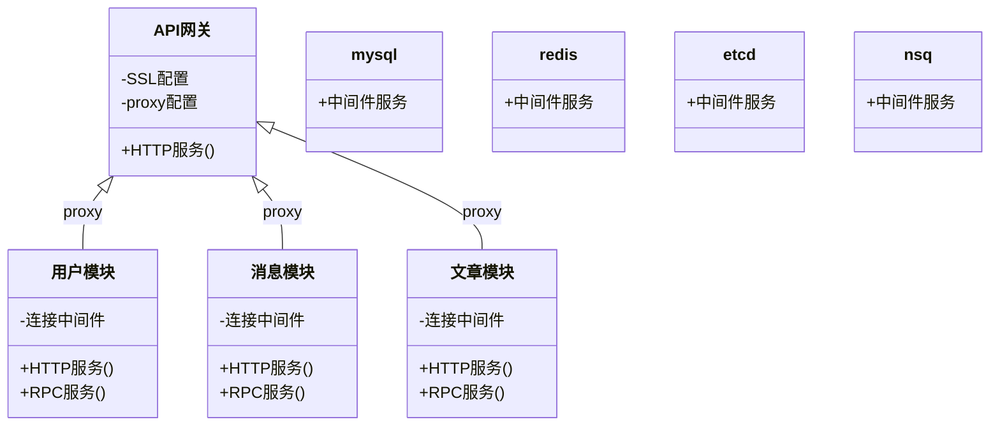
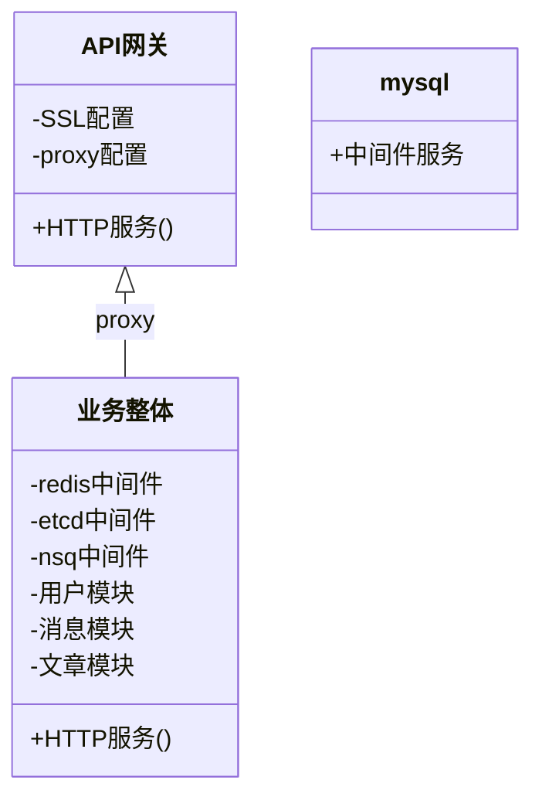

## docker-compose是什么

> *docker-compose* 是用于定义和运行多容器 docker 应用程序的工具。

> 对比普通docker部署应用，通过 *docker-compose* 的定义 *yaml* 文件的方式部署应用，可以**大大简化**部署流程。

以 *微服务架构* 在单节点上部署为例:

- 普通docker部署:



可以看出，普通docker部署需要在服务器上配置每一个模块、中间件，
最终通过API网关(Nginx)的逐条反向代理方式将各服务的能力整合和对外发布。
整个配置流程非常繁杂。

- 通过docker-compose部署:



通过docker-compose的编排特性，可以将多个微服务正在在一次compose部署中。
最终api网关仅需配置一次反向代理，就可以完成服务的发布。

## docker-compose安装

> 参见[docker与docker-compose安装](docker.md#docker-compose安装)

## 部署理念与步骤
  
- docker-compose部署使微服务项目可以在单节点主机上落地。
  
- docker-compose部署的应用以后都可以切换到kubernetes部署。
  
- docker-compose部署在满足上述要求的同时，要尽可能的简单，尽可能的封装细节。

- 保留各服务的运行日志。必要时还要做 *logrotate* 。

### Examples

1. 目录说明。通常每个项目会有一个代号 *{project}* ，而部署路径就在 */data/{project}/* 。

```tree
.
├── .env                              # 运行环境变量定义
├── admin8.key                        # 管理员token私钥(pkcs8格式)
├── admin.key                         # 管理员token私钥
├── admin.pub                         # 管理员token公钥
├── docker-compose.yml                # compose配置文件
├── etcd3                             # etcd3(中间件)运行目录
│   └── data                          # etcd数据持久化目录
│       └── default.etcd              # etcd数据持久化
├── java.sh                           # java应用运行统一脚本
├── lang                              # 多语言错误翻译目录
│   ├── msg.json                      # 消息模块错误翻译
│   ├── project.json                  # 本项目错误翻译
│   ├── rest.json                     # 全局关键错误翻译
│   ├── restlang.json                 # 多语言选择错误翻译
│   └── user.json                     # 用户模块错误翻译
├── lang.sh                           # 多语言配置更新脚本
├── msg                               # 消息模块目录
│   ├── run                           # 模块运行目录
│   │   ├── config.read               # 只读配置信息，如数据库连接方式
│   │   ├── config.write              # 可写配置信息，如管理员调整业务参数
│   │   ├── database.log              # 数据库(初始化)相关日志
│   │   ├── project.access.log        # http访问日志
│   │   ├── project.event.log         # 消息队列相关日志
│   │   ├── project.logic.log         # 业务功能相关日志
│   │   ├── rpc.log                   # rcp调用相关日志
│   │   └── standard.log              # 未重定向的日志
│   └── serve                         # 消息模块执行程序
├── project                           # 本项目模块目录
│   ├── project.jar                   # 本项目块执行jar包
│   └── project.jar.old               # 本项目块执行jar包(上一个执行版本,保留便于出错时快速回滚)
├── redis                             # redis(中间件)运行目录
│   └── data                          # redis数据持久化目录
│       └── dump.rdb                  # redis数据持久化
├── run.sh                            # go应用运行统一脚本
├── user                              # 用户模块目录
│   ├── run                           # 模块运行目录
│   │   ├── config.read               # 只读配置信息，如数据库连接方式
│   │   ├── config.write              # 可写配置信息，如管理员调整业务参数
│   │   ├── database.log              # 数据库(初始化)相关日志
│   │   ├── rpc.log                   # rcp调用相关日志
│   │   ├── standard.log              # 未重定向的日志
│   │   ├── user.access.log           # http访问日志(普通用户相关API)
│   │   ├── user.admin.log            # http访问日志(工作人员相关API)
│   │   ├── user.ctrl.log             # ctrl层相关日志
│   │   ├── user.etcd.log             # etcd相关日志
│   │   ├── user.event.log            # 消息队列相关日志
│   │   ├── user.logic.log            # 业务功能相关日志
│   │   └── user.weixin.log           # 微信功能相关日志
│   └── serve                         # 用户模块执行程序
├── user8.key                         # 用户token私钥(pkcs8格式)
├── user.key                          # 用户token私钥
└── user.pub                          # 用户token公钥
```

2.1 启动服务。即标准的docker-compose启动方式。

```bash
cd /data/{project}/     # 进入项目所在目录
docker-compose up -d    # 启动服务，并自动运行
```

2.2 停止服务。即标准的docker-compose停止方式。

```bash
cd /data/{project}/     # 进入项目所在目录
docker-compose down     # 停止服务，并等待完成
```

- 服务停止后，以下模块(中间件)的数据是冗余可清除的：
  1. ./**etcd3**/data/
  2. ./**redis**/data/

2.2 查看正在运行的服务。

```bash
cd /data/{project}/     # 进入项目所在目录
docker-compose ps       # 查看每个模块的运行状态
```

举例输出:

```code
       Name                      Command                State                                                                     Ports
------------------------------------------------------------------------------------------------------------------------------------------------------------------------------------------------------
project_etcd3_1        /usr/local/bin/etcd --list ...   Up      0.0.0.0:49156->2379/tcp,:::49156->2379/tcp, 0.0.0.0:49156->2379/udp,:::49156->2379/udp, 2380/tcp
project_msg_1          /run.sh                          Up      0.0.0.0:51583->8083/tcp,:::51583->8083/tcp, 0.0.0.0:51593->8093/tcp,:::51593->8093/tcp
project_nsqadmin_1     /nsqadmin -http-address=0. ...   Up      4150/tcp, 4151/tcp, 4160/tcp, 4161/tcp, 4170/tcp, 4171/tcp, 0.0.0.0:51571->51571/tcp,:::51571->51571/tcp
project_nsqd_1         /nsqd -tcp-address=0.0.0.0 ...   Up      4150/tcp, 4151/tcp, 4160/tcp, 4161/tcp, 4170/tcp, 4171/tcp, 0.0.0.0:51550->51550/tcp,:::51550->51550/tcp
project_nsqlookupd_1   /nsqlookupd -tcp-address=0 ...   Up      4150/tcp, 4151/tcp, 4160/tcp, 4161/tcp, 4170/tcp, 4171/tcp, 0.0.0.0:51560->51560/tcp,:::51560->51560/tcp
project_online_1       /run.sh                          Up      0.0.0.0:51581->8081/tcp,:::51581->8081/tcp, 0.0.0.0:51591->8091/tcp,:::51591->8091/tcp
project_project_1      /home/java-app/docker-entr ...   Up      8080/tcp, 0.0.0.0:51588->8280/tcp,:::51588->8280/tcp
project_redis_1        docker-entrypoint.sh redis ...   Up      0.0.0.0:51579->6379/tcp,:::51579->6379/tcp
project_user_1         /run.sh                          Up      0.0.0.0:51570->7070/tcp,:::51570->7070/tcp, 0.0.0.0:51580->8080/tcp,:::51580->8080/tcp, 0.0.0.0:51590->8090/tcp,:::51590->8090/tcp
```

2.3 查看日志。

- 查看user模块的最新100行日志并监听最新日志:

```bash
docker logs -f project_user_1 --tail 100
```

