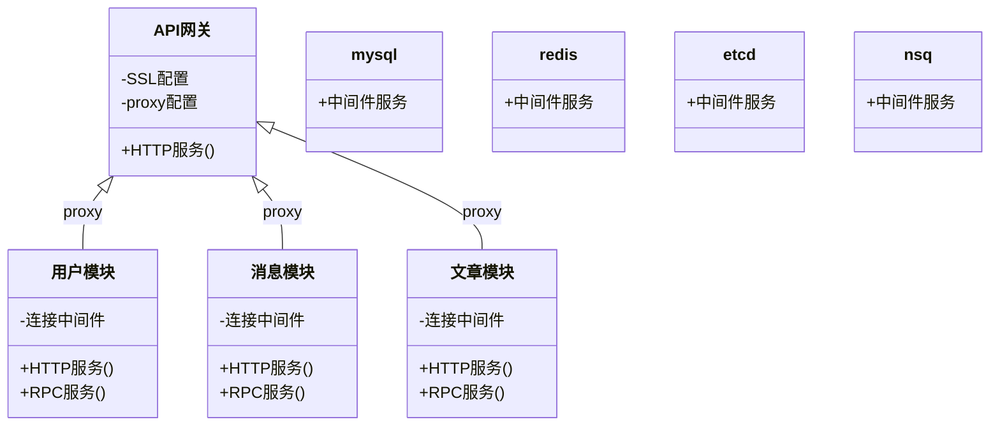
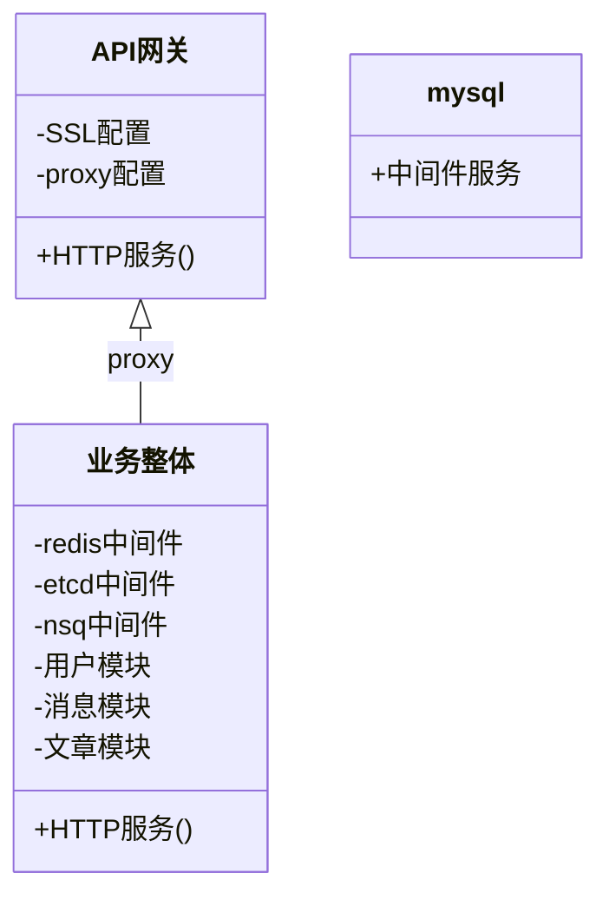

## docker-compose是什么

> *docker-compose* 是用于定义和运行多容器 docker 应用程序的工具。

> 对比普通docker部署应用，通过 *docker-compose* 的定义 *yaml* 文件的方式部署应用，可以**大大简化**部署流程。

以 *微服务架构* 在单节点上部署为例:

- 普通docker部署:

可以看出，普通docker部署需要在服务器上配置每一个模块、中间件，
最终通过API网关(Nginx)的逐条反向代理方式将各服务的能力整合和对外发布。
整个配置流程非常繁杂。

- 通过docker-compose部署:

通过docker-compose的编排特性，可以将多个微服务正在在一次compose部署中。
最终api网关仅需配置一次反向代理，就可以完成服务的发布。

## docker-compose安装

> 参见[docker与docker-compose安装](docker.md#docker-compose安装)

## 部署理念与步骤
